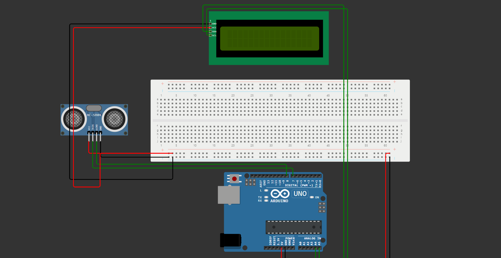

#  Monitor de Proximidade 🏎️

## Descrição 📝
Este projeto consite na criação de um dispositivo para medir a distância entre outro obstáculo e/ou oponente.

O dispositivo mede as distâncias de oponentes e obstaáculos em tempo real, trazendo uma maior precisão para o piloto tomar sua decisão🧠.

Utilizamos o sensor HC-SR04 para a medição das distâncias e os resultados são mostrados em uma tela LCD junto a uma sugestão.

Se a distância for menor que 1 metro, o display exibe a distância juntamente com a frase "MUITO PERTO!". 

Se a distância for maior, o display também mostra a distância, porém com a frase "BOA DISTÂNCIA!" :white_check_mark: .

O projeto tem a finalidade de tornar as ultrapassagens certeiras e mais seguras, e também minimizar o risco de perder alguma peça do carro e previnir colisões :collision:.

## Materiais Necessários ⚒️

- Placa Arduino (ou similar)
- Sensor de Ultrassom HC-SR04
- Display LCD 16x2 com interface I2C
- Fios jumper
- Protoboard (opcional)

  
## Como Construir ⚙️

### 1. Montagem do Circuito 🧩:

Conecte o sensor de ultrassom HC-SR04 à placa Arduino conforme o esquema de pinagem fornecido na documentação do sensor.

Conecte o display LCD 16x2 com interface I2C à placa Arduino seguindo o esquema de pinagem específico da interface I2C.

Utilize o esquema a seguir como guia, se prefirir:

#### ⚠️ Caso prefira fazer a montagem e testar on-line utilize o site [WOKIWI](https://wokwi.com/) 
  

    
Imagem do circuito:

    
  

 
### 2. Instalação das Bibliotecas📚:

Certifique-se de ter as bibliotecas necessárias instaladas em seu ambiente Arduino:

- *NewPing.h* para o sensor de ultrassom.
- *LiquidCrystal_I2C.h* para o display LCD com interface I2C.

### 3. Carregamento do Código 💻:

Abra o [código fonte](codigo_fonte.cpp) do projeto (fornecido neste repositório) no Arduino IDE.
Verifique se o código está configurado corretamente com as portas correspondentes aos componentes do seu circuito.
Carregue o código para a placa Arduino.

### 4. Execução ▶️ :

Após a montagem, ligue a placa Arduino.
O monitor de distância começará a medir e exibir a distância no display LCD.

## Autores 🖋️
### Este projeto foi realizado por alunos de Engenharia de Software da FIAP da turma 1ESPH 2024.1

- [Giulia Barbizan](https://github.com/Giulia-Rocha)
- [Leonardo Rocha](https://github.com/leonardorscarpitta)
- [Felipe Marques](https://github.com/FelipeMarquesdeOliveira)
- [Gustavo Viega](https://github.com/Vieg4)

